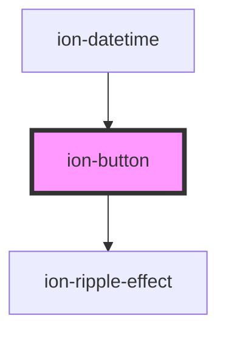

import Playground from '../../src/components/global/Playground';

# IonButton

Buttons provide a clickable element, which can be used in forms, or anywhere that needs simple, standard button functionality. They may display text, icons, or both. Buttons can be styled with several attributes to look a specific way.

<Playground
  src="/docs/code/button/usage/basic/index.html"
  code={{
    basic: '/docs/code/button/usage/basic/javascript.md',
    angular: '/docs/code/button/usage/basic/angular.md',
    react: '/docs/code/button/usage/basic/react.md',
    vue: '/docs/code/button/usage/basic/vue.md',
  }}
/>

## Colors

The `color` attribute specifies the background color of the button.

<Playground
  src="/docs/code/button/usage/color/index.html"
  code={{
    basic: '/docs/code/button/usage/color/javascript.md',
    angular: '/docs/code/button/usage/color/angular.md',
    react: '/docs/code/button/usage/color/react.md',
    vue: '/docs/code/button/usage/color/vue.md',
  }}
/>

## Expand

The `expand` attribute will expand the button to fill the available space. Setting this attribute with `block` will create a full-width button with rounded corners. Setting this attribute with `full` will create a full-width button with square corners and no border on the left or right.

<Playground
  src="/docs/code/button/usage/expand/index.html"
  code={{
    basic: '/docs/code/button/usage/expand/javascript.md',
  }}
/>

## Fill

The `fill` attribute determines the background and border color of the button. By default, buttons have a solid background unless the button is inside of a toolbar, in which case it has a transparent background.

<Playground
  src="/docs/code/button/usage/fill/index.html"
  code={{
    basic: '/docs/code/button/usage/fill/javascript.md',
  }}
/>

## Size

This attribute specifies the size of the button. Setting this attribute will change the height and padding of a button.

<Playground
  src="/docs/code/button/usage/size/index.html"
  code={{
    basic: '/docs/code/button/usage/size/javascript.md',
  }}
/>

<!-- Auto Generated Below -->

## Properties

| Property          | Attribute          | Description                                                                                                                                                                                                                                                                               | Type                                                        | Default     |
| ----------------- | ------------------ | ----------------------------------------------------------------------------------------------------------------------------------------------------------------------------------------------------------------------------------------------------------------------------------------- | ----------------------------------------------------------- | ----------- |
| `buttonType`      | `button-type`      | The type of button.                                                                                                                                                                                                                                                                       | `string`                                                    | `'button'`  |
| `color`           | `color`            | The color to use from your application's color palette. Default options are: `"primary"`, `"secondary"`, `"tertiary"`, `"success"`, `"warning"`, `"danger"`, `"light"`, `"medium"`, and `"dark"`. For more information on colors, see [theming](/docs/theming/basics).                    | `string \| undefined`                                       | `undefined` |
| `disabled`        | `disabled`         | If `true`, the user cannot interact with the button.                                                                                                                                                                                                                                      | `boolean`                                                   | `false`     |
| `download`        | `download`         | This attribute instructs browsers to download a URL instead of navigating to it, so the user will be prompted to save it as a local file. If the attribute has a value, it is used as the pre-filled file name in the Save prompt (the user can still change the file name if they want). | `string \| undefined`                                       | `undefined` |
| `expand`          | `expand`           | Set to `"block"` for a full-width button or to `"full"` for a full-width button without left and right borders.                                                                                                                                                                           | `"block" \| "full" \| undefined`                            | `undefined` |
| `fill`            | `fill`             | Set to `"clear"` for a transparent button, to `"outline"` for a transparent button with a border, or to `"solid"`. The default style is `"solid"` except inside of a toolbar, where the default is `"clear"`.                                                                             | `"clear" \| "default" \| "outline" \| "solid" \| undefined` | `undefined` |
| `href`            | `href`             | Contains a URL or a URL fragment that the hyperlink points to. If this property is set, an anchor tag will be rendered.                                                                                                                                                                   | `string \| undefined`                                       | `undefined` |
| `mode`            | `mode`             | The mode determines which platform styles to use.                                                                                                                                                                                                                                         | `"ios" \| "md"`                                             | `undefined` |
| `rel`             | `rel`              | Specifies the relationship of the target object to the link object. The value is a space-separated list of [link types](https://developer.mozilla.org/en-US/docs/Web/HTML/Link_types).                                                                                                    | `string \| undefined`                                       | `undefined` |
| `routerAnimation` | --                 | When using a router, it specifies the transition animation when navigating to another page using `href`.                                                                                                                                                                                  | `((baseEl: any, opts?: any) => Animation) \| undefined`     | `undefined` |
| `routerDirection` | `router-direction` | When using a router, it specifies the transition direction when navigating to another page using `href`.                                                                                                                                                                                  | `"back" \| "forward" \| "root"`                             | `'forward'` |
| `shape`           | `shape`            | The button shape.                                                                                                                                                                                                                                                                         | `"round" \| undefined`                                      | `undefined` |
| `size`            | `size`             | The button size.                                                                                                                                                                                                                                                                          | `"default" \| "large" \| "small" \| undefined`              | `undefined` |
| `strong`          | `strong`           | If `true`, activates a button with a heavier font weight.                                                                                                                                                                                                                                 | `boolean`                                                   | `false`     |
| `target`          | `target`           | Specifies where to display the linked URL. Only applies when an `href` is provided. Special keywords: `"_blank"`, `"_self"`, `"_parent"`, `"_top"`.                                                                                                                                       | `string \| undefined`                                       | `undefined` |
| `type`            | `type`             | The type of the button.                                                                                                                                                                                                                                                                   | `"button" \| "reset" \| "submit"`                           | `'button'`  |

## Events

| Event      | Description                          | Type                |
| ---------- | ------------------------------------ | ------------------- |
| `ionBlur`  | Emitted when the button loses focus. | `CustomEvent<void>` |
| `ionFocus` | Emitted when the button has focus.   | `CustomEvent<void>` |

## Slots

| Slot          | Description                                                                       |
| ------------- | --------------------------------------------------------------------------------- |
|               | Content is placed between the named slots if provided without a slot.             |
| `"end"`       | Content is placed to the right of the button text in LTR, and to the left in RTL. |
| `"icon-only"` | Should be used on an icon in a button that has no text.                           |
| `"start"`     | Content is placed to the left of the button text in LTR, and to the right in RTL. |

## Shadow Parts

| Part       | Description                                                             |
| ---------- | ----------------------------------------------------------------------- |
| `"native"` | The native HTML button or anchor element that wraps all child elements. |

## CSS Custom Properties

| Name                             | Description                                                                                               |
| -------------------------------- | --------------------------------------------------------------------------------------------------------- |
| `--background`                   | Background of the button                                                                                  |
| `--background-activated`         | Background of the button when pressed. Note: setting this will interfere with the Material Design ripple. |
| `--background-activated-opacity` | Opacity of the button when pressed                                                                        |
| `--background-focused`           | Background of the button when focused with the tab key                                                    |
| `--background-focused-opacity`   | Opacity of the button when focused with the tab key                                                       |
| `--background-hover`             | Background of the button on hover                                                                         |
| `--background-hover-opacity`     | Opacity of the background on hover                                                                        |
| `--border-color`                 | Border color of the button                                                                                |
| `--border-radius`                | Border radius of the button                                                                               |
| `--border-style`                 | Border style of the button                                                                                |
| `--border-width`                 | Border width of the button                                                                                |
| `--box-shadow`                   | Box shadow of the button                                                                                  |
| `--color`                        | Text color of the button                                                                                  |
| `--color-activated`              | Text color of the button when pressed                                                                     |
| `--color-focused`                | Text color of the button when focused with the tab key                                                    |
| `--color-hover`                  | Text color of the button when hover                                                                       |
| `--opacity`                      | Opacity of the button                                                                                     |
| `--padding-bottom`               | Bottom padding of the button                                                                              |
| `--padding-end`                  | Right padding if direction is left-to-right, and left padding if direction is right-to-left of the button |
| `--padding-start`                | Left padding if direction is left-to-right, and right padding if direction is right-to-left of the button |
| `--padding-top`                  | Top padding of the button                                                                                 |
| `--ripple-color`                 | Color of the button ripple effect                                                                         |
| `--transition`                   | Transition of the button                                                                                  |

## Dependencies

### Used by

- [ion-datetime](../datetime)

### Depends on

- [ion-ripple-effect](../ripple-effect)

### Graph

---

_Built with [StencilJS](https://stenciljs.com/)_
